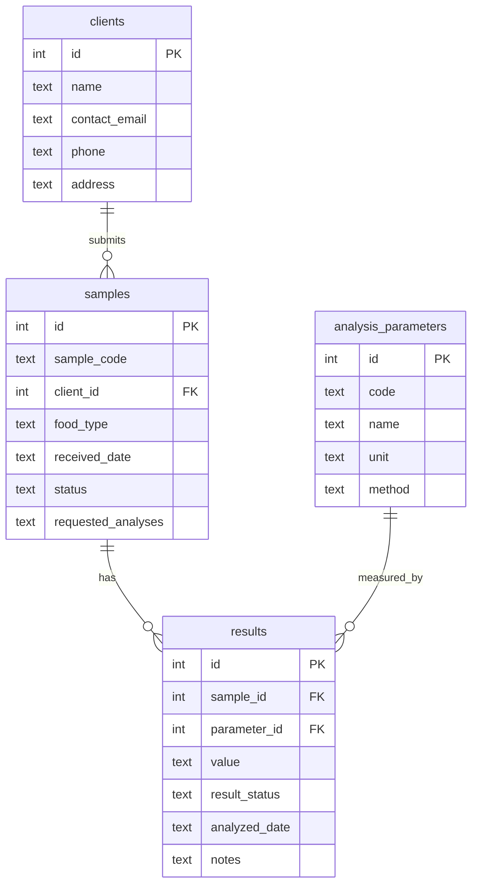

# Servidor MCP LIMS de Análisis de Alimentos -- Especificación

> Traducción al español para referencia. La versión oficial es
> [`lims_mcp_server_spec.md`](lims_mcp_server_spec.md) (en inglés).

Caso de uso a nivel de industria: un laboratorio de análisis de
inocuidad de alimentos (fisicoquímico y microbiológico) que recibe
muestras de clientes como plantas procesadoras, restaurantes y
exportadoras. Este servidor expone el sistema de seguimiento de
muestras del laboratorio como tools de MCP, para que un chatbot pueda
registrar muestras, consultar su estado, obtener resultados y generar
reportes listos para el cliente en lenguaje natural.

## Implementación del protocolo

- **Transporte:** stdio. El servidor lee mensajes JSON-RPC 2.0
  delimitados por saltos de línea desde stdin y escribe mensajes
  JSON-RPC 2.0 delimitados por saltos de línea a stdout. Un mensaje por
  línea, sin saltos de línea embebidos, sin framing de
  `Content-Length`.
- **No se usa ningún SDK de MCP.** Todo el framing de JSON-RPC, el
  handshake de `initialize`, el descubrimiento de tools y su invocación
  están implementados a mano en
  [`lims_mcp_server/`](../lims_mcp_server): `jsonrpc.py` (lectura/
  escritura de mensajes + códigos de error de JSON-RPC), `protocol.py`
  (handlers de métodos MCP) y `server.py` (el loop de eventos
  stdin/stdout).
- **Versión de protocolo negociada:** `2025-06-18` (retrocede a
  `2025-03-26` o `2024-11-05` si el cliente solicita alguna de esas en
  su lugar).
- **Capacidades anunciadas:** solo `tools` (sin `resources`, sin
  `prompts`, sin `logging`).
- **Logging:** toda la salida de diagnóstico va a stderr, nunca a
  stdout, para no corromper el flujo del protocolo.

### Métodos del ciclo de vida

| Método | Dirección | Notas |
|---|---|---|
| `initialize` | solicitud | Negocia la versión de protocolo, retorna `capabilities`, `serverInfo`, `instructions`. |
| `notifications/initialized` | notificación | Enviada por el cliente después de `initialize`; el servidor solo la reconoce internamente. |
| `ping` | solicitud | Retorna `{}`. |
| `tools/list` | solicitud | Retorna las 5 definiciones de tools con `inputSchema` en JSON Schema. |
| `tools/call` | solicitud | Ejecuta una tool; retorna `{ content: [...], isError }`. |

### Manejo de errores

- JSON mal formado, `method` faltante, o `method` desconocido en una
  solicitud: errores estándar de JSON-RPC 2.0 (`-32700`, `-32600`,
  `-32601`).
- Las notificaciones nunca se responden con un objeto de respuesta, ni
  siquiera en caso de error (según JSON-RPC 2.0).
- **Los fallos de ejecución de una tool (entrada inválida, muestra no
  encontrada, etc.) NO son errores de JSON-RPC.** Se retornan como un
  resultado normal de `tools/call` con `isError: true` y un mensaje
  legible en `content`, según la convención de MCP -- esto permite que
  el LLM vea el fallo y reaccione (p. ej. pedirle al usuario un código
  de muestra corregido).

## Tools

Las cinco tools fueron propuestas para este proyecto y están
implementadas exactamente como se especificaron.

### `register_sample`

Registra una nueva muestra recibida por el laboratorio.

**Esquema de entrada**

| Campo | Tipo | Requerido | Descripción |
|---|---|---|---|
| `client_name` | string | sí | Cliente/empresa que envía la muestra. Se crea automáticamente si es nuevo. |
| `food_type` | string | sí | Tipo de producto alimenticio, p. ej. `"queso fresco"`. |
| `requested_analyses` | string[] | sí | Uno o más códigos de parámetro (ver tabla abajo). |
| `received_date` | string | no | `YYYY-MM-DD`. Por defecto, hoy. |

**Ejemplo de llamada**

```json
{"name": "register_sample", "arguments": {
  "client_name": "Panificadora Dona Marta",
  "food_type": "pan de molde",
  "requested_analyses": ["ph", "yeast_mold"]
}}
```

**Ejemplo de resultado** (`content[0].text`, JSON con formato)

```json
{
  "sample_code": "LIMS-2026-0081",
  "client_name": "Panificadora Dona Marta",
  "food_type": "pan de molde",
  "received_date": "2026-08-24",
  "status": "received",
  "requested_analyses": ["ph", "yeast_mold"]
}
```

Los códigos de muestra siguen `LIMS-<año>-<0001..9999>`, secuenciales
por año.

### `get_sample_status`

Retorna el estado actual (`received` / `in_analysis` / `finalized`) y
metadatos básicos de una muestra.

| Campo | Tipo | Requerido |
|---|---|---|
| `sample_code` | string | sí |

### `get_analysis_results`

Retorna todos los resultados registrados para una muestra (cada
parámetro solicitado que ya haya sido analizado, con
`pass`/`fail`/`pending`).

| Campo | Tipo | Requerido |
|---|---|---|
| `sample_code` | string | sí |

### `list_pending_samples`

Lista todas las muestras cuyo estado aún no es `finalized`,
opcionalmente restringido a un rango de `received_date`.

| Campo | Tipo | Requerido |
|---|---|---|
| `date_from` | string (`YYYY-MM-DD`) | no |
| `date_to` | string (`YYYY-MM-DD`) | no |

### `generate_report_summary`

Construye un reporte en texto plano, listo para el cliente, de una
muestra: encabezado, análisis solicitados, resultados por parámetro, y
un veredicto general `PASS` / `FAIL` / `PENDING`.

| Campo | Tipo | Requerido |
|---|---|---|
| `sample_code` | string | sí |

**Ejemplo de resultado** (`content[0].text`, texto plano -- no JSON,
ya que la salida de esta tool está pensada para leerse directamente)

```
LABORATORY REPORT SUMMARY
==========================
Sample code: LIMS-2026-0032
Client: Lacteos San Miguel
Food type: queso fresco
Received date: 2026-07-06
Status: in_analysis

Requested analyses: pH, Coliformes fecales, Salmonella spp.

Results:
  - Coliformes fecales: 3 NMP/g (pass) - analyzed 2026-07-08
  - pH: pending
  - Salmonella spp.: Ausente (pass) - analyzed 2026-07-09

Overall verdict: PENDING
Note: report is preliminary, 1 parameter(s) still pending.
```

## Catálogo de parámetros de análisis

| Código | Nombre | Unidad | Método | Regla de aprobación (datos demo) |
|---|---|---|---|---|
| `ph` | pH | -- | AOAC 981.12 | 3.5 <= valor <= 8.5 |
| `fecal_coliforms` | Coliformes fecales | NMP/g | AOAC 966.24 | valor <= 10 |
| `salmonella` | Salmonella spp. | presencia/25g | AOAC 2016.01 | "Ausente" |
| `total_aerobic_count` | Recuento de aerobios totales | UFC/g | AOAC 990.12 | valor <= 100000 |
| `moisture` | Humedad | % | AOAC 925.09 | solo informativo |
| `water_activity` | Actividad de agua (aw) | aw | AOAC 978.18 | valor <= 0.85 |
| `staph_aureus` | Staphylococcus aureus | UFC/g | AOAC 2003.07 | valor <= 100 |
| `e_coli` | Escherichia coli | NMP/g | AOAC 991.14 | valor <= 10 |
| `listeria` | Listeria monocytogenes | presencia/25g | AOAC 993.09 | "Ausente" |
| `yeast_mold` | Mohos y levaduras | UFC/g | AOAC 997.02 | valor <= 1000 |

Estos umbrales están simplificados para el propósito del set de datos
de demo, no son límites regulatorios reales.

## Modelo de datos

Base de datos SQLite (`data/lims.db`, solo `sqlite3` de la librería
estándar, sin ORM). Ver
[`lims_mcp_server/schema.sql`](../lims_mcp_server/schema.sql):



`data/lims.db` se puebla con datos sintéticos: 10 clientes recurrentes,
los 10 parámetros de arriba, y 50-100 muestras repartidas en
aproximadamente los últimos 75 días en estados `received` /
`in_analysis` / `finalized`, cada una con resultados
pass/fail plausibles (ver
[`lims_mcp_server/seed.py`](../lims_mcp_server/seed.py)).

## Ejemplos de uso

Ver [`tests/manual_client.py`](../tests/manual_client.py) para un
ejemplo ejecutable de punta a punta que levanta el servidor y ejercita
`initialize`, `tools/list`, y las 5 tools (incluyendo el camino de
error de "no encontrado"), imprimiendo cada mensaje JSON-RPC crudo
intercambiado. Las instrucciones de instalación y ejecución están en el
[README](../README.md) del repositorio.
