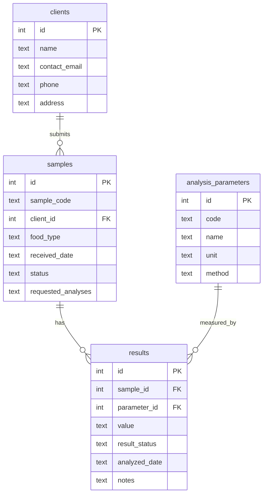

# LIMS Food Analysis MCP Server -- Specification

Industry use case: a food-safety testing laboratory (physicochemical and
microbiological analysis) that receives samples from clients such as food
processing plants, restaurants and exporters. This server exposes the
lab's sample tracking system as MCP tools so a chatbot can register
samples, check their status, retrieve results and produce client-ready
reports in natural language.

## Protocol implementation

- **Transport:** stdio. The server reads newline-delimited JSON-RPC 2.0
  messages from stdin and writes newline-delimited JSON-RPC 2.0 messages to
  stdout. One message per line, no embedded newlines, no `Content-Length`
  framing.
- **No MCP SDK used.** All JSON-RPC framing, the `initialize` handshake,
  tool discovery and tool invocation are implemented by hand in
  [`lims_mcp_server/`](../lims_mcp_server): `jsonrpc.py` (message
  read/write + JSON-RPC error codes), `protocol.py` (MCP method handlers)
  and `server.py` (the stdin/stdout event loop).
- **Protocol version negotiated:** `2025-06-18` (falls back to
  `2025-03-26` or `2024-11-05` if the client requests one of those
  instead).
- **Capabilities advertised:** `tools` only (no `resources`, no
  `prompts`, no `logging`).
- **Logging:** all diagnostic output goes to stderr, never stdout, so it
  never corrupts the protocol stream.

### Lifecycle methods

| Method | Direction | Notes |
|---|---|---|
| `initialize` | request | Negotiates protocol version, returns `capabilities`, `serverInfo`, `instructions`. |
| `notifications/initialized` | notification | Sent by the client after `initialize`; server just acknowledges internally. |
| `ping` | request | Returns `{}`. |
| `tools/list` | request | Returns the 5 tool definitions with JSON Schema `inputSchema`. |
| `tools/call` | request | Executes a tool; returns `{ content: [...], isError }`. |

### Error handling

- Malformed JSON, missing `method`, or unknown `method` on a request:
  standard JSON-RPC 2.0 errors (`-32700`, `-32600`, `-32601`).
- Notifications with no response object are never answered, even on
  error (per JSON-RPC 2.0).
- **Tool execution failures (bad input, sample not found, etc.) are NOT
  JSON-RPC errors.** They are returned as a normal `tools/call` result
  with `isError: true` and a human-readable message in `content`, per MCP
  convention -- this lets the LLM see the failure and react to it (e.g.
  ask the user for a corrected sample code).

## Tools

All five tools were proposed for this project and are implemented exactly
as specified.

### `register_sample`

Registers a new sample received by the laboratory.

**Input schema**

| Field | Type | Required | Description |
|---|---|---|---|
| `client_name` | string | yes | Client/company submitting the sample. Created automatically if new. |
| `food_type` | string | yes | Food product type, e.g. `"queso fresco"`. |
| `requested_analyses` | string[] | yes | One or more parameter codes (see table below). |
| `received_date` | string | no | `YYYY-MM-DD`. Defaults to today. |

**Example call**

```json
{"name": "register_sample", "arguments": {
  "client_name": "Panificadora Dona Marta",
  "food_type": "pan de molde",
  "requested_analyses": ["ph", "yeast_mold"]
}}
```

**Example result** (`content[0].text`, pretty-printed JSON)

```json
{
  "sample_code": "LIMS-2026-0081",
  "client_name": "Panificadora Dona Marta",
  "food_type": "pan de molde",
  "received_date": "2026-08-24",
  "status": "received",
  "requested_analyses": ["ph", "yeast_mold"]
}
```

Sample codes follow `LIMS-<year>-<0001..9999>`, sequential per year.

### `get_sample_status`

Returns the current status (`received` / `in_analysis` / `finalized`) and
basic metadata for one sample.

| Field | Type | Required |
|---|---|---|
| `sample_code` | string | yes |

### `get_analysis_results`

Returns every recorded result for a sample (each requested parameter that
has already been analyzed, with `pass`/`fail`/`pending`).

| Field | Type | Required |
|---|---|---|
| `sample_code` | string | yes |

### `list_pending_samples`

Lists every sample whose status is not yet `finalized`, optionally
restricted to a `received_date` range.

| Field | Type | Required |
|---|---|---|
| `date_from` | string (`YYYY-MM-DD`) | no |
| `date_to` | string (`YYYY-MM-DD`) | no |

### `generate_report_summary`

Builds a plain-text, client-ready report for a sample: header, requested
analyses, per-parameter results, and an overall `PASS` / `FAIL` /
`PENDING` verdict.

| Field | Type | Required |
|---|---|---|
| `sample_code` | string | yes |

**Example result** (`content[0].text`, plain text -- not JSON, since this
tool's output is meant to be read directly)

```
LABORATORY REPORT SUMMARY
==========================
Sample code: LIMS-2026-0032
Client: Lacteos San Miguel
Food type: queso fresco
Received date: 2026-07-06
Status: in_analysis

Requested analyses: pH, Coliformes fecales, Salmonella spp.

Results:
  - Coliformes fecales: 3 NMP/g (pass) - analyzed 2026-07-08
  - pH: pending
  - Salmonella spp.: Ausente (pass) - analyzed 2026-07-09

Overall verdict: PENDING
Note: report is preliminary, 1 parameter(s) still pending.
```

## Analysis parameter catalog

| Code | Name | Unit | Method | Pass rule (demo data) |
|---|---|---|---|---|
| `ph` | pH | -- | AOAC 981.12 | 3.5 <= value <= 8.5 |
| `fecal_coliforms` | Coliformes fecales | NMP/g | AOAC 966.24 | value <= 10 |
| `salmonella` | Salmonella spp. | presencia/25g | AOAC 2016.01 | "Ausente" |
| `total_aerobic_count` | Recuento de aerobios totales | UFC/g | AOAC 990.12 | value <= 100000 |
| `moisture` | Humedad | % | AOAC 925.09 | informational only |
| `water_activity` | Actividad de agua (aw) | aw | AOAC 978.18 | value <= 0.85 |
| `staph_aureus` | Staphylococcus aureus | UFC/g | AOAC 2003.07 | value <= 100 |
| `e_coli` | Escherichia coli | NMP/g | AOAC 991.14 | value <= 10 |
| `listeria` | Listeria monocytogenes | presencia/25g | AOAC 993.09 | "Ausente" |
| `yeast_mold` | Mohos y levaduras | UFC/g | AOAC 997.02 | value <= 1000 |

These thresholds are simplified for the purpose of the demo dataset, not
real regulatory limits.

## Data model

SQLite database (`data/lims.db`, stdlib `sqlite3` only, no ORM). See
[`lims_mcp_server/schema.sql`](../lims_mcp_server/schema.sql):



`data/lims.db` is seeded with synthetic data: 10 recurring clients, the 10
parameters above, and 50-100 samples spread over roughly the last 75 days
in `received` / `in_analysis` / `finalized` states, each with plausible
pass/fail results (see [`lims_mcp_server/seed.py`](../lims_mcp_server/seed.py)).

## Usage examples

See [`tests/manual_client.py`](../tests/manual_client.py) for a runnable,
end-to-end example that spawns the server and exercises `initialize`,
`tools/list`, and all 5 tools (including the not-found error path),
printing every raw JSON-RPC message exchanged. Installation and run
instructions are in the repository [README](../README.md).
